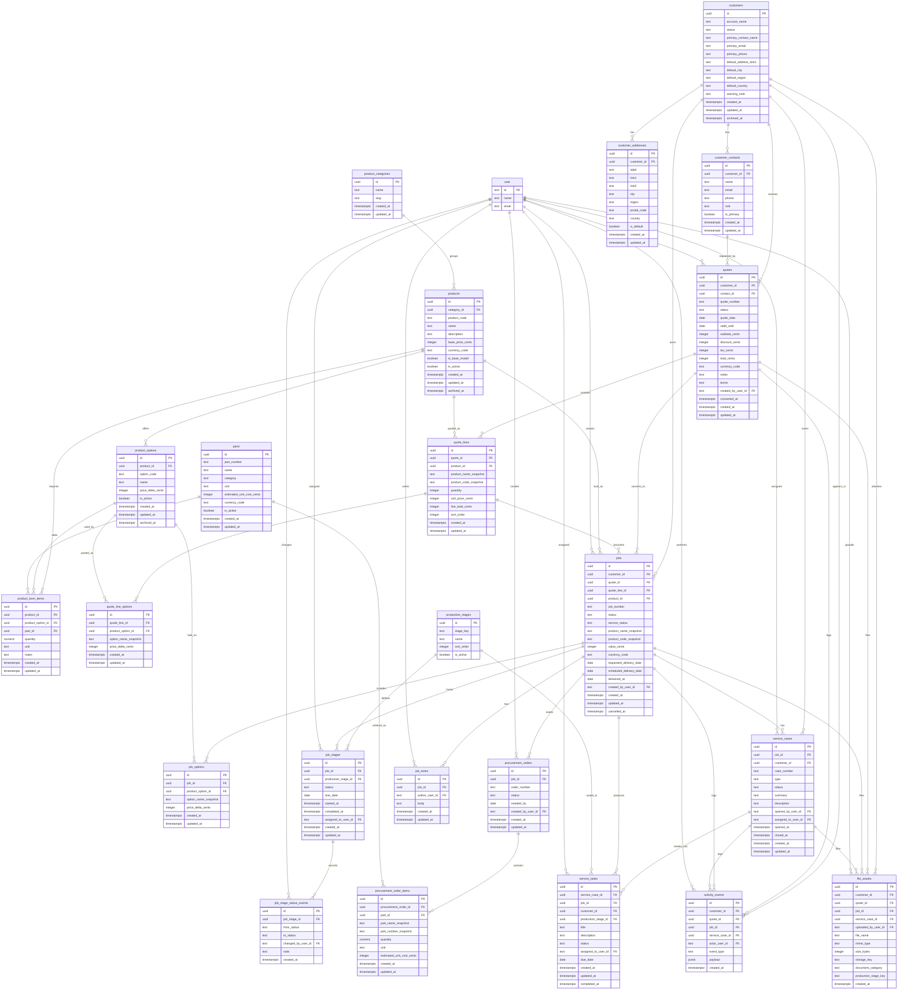

# Prototype Domain ERD

Source: May 2026 prototype screenshots for dashboard, sales/quotes, jobs, procurement, fabrication, paint, assembly, dispatch, customer success, products, and customers.

Design notes:

- App-owned domain tables use UUID primary keys.
- Better Auth-owned user IDs remain string IDs in the existing `user` table.
- Quote and job line data intentionally stores commercial snapshots so old quotes/jobs do not change when the product catalog changes.
- Stage-specific screens are driven from `job_stages` rows rather than separate procurement/fabrication/paint/assembly/dispatch job tables.

